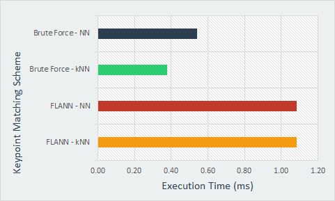
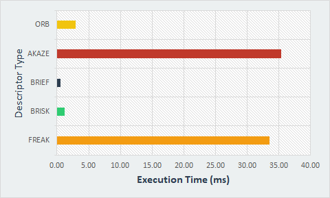
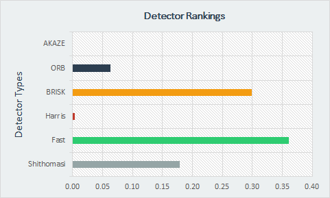

# 2D_Feature_Tracking

The idea of the camera course is to build a collision detection system - that's the overall goal for the Final Project. This mid-term project consists of four parts:

* Loading images, setting up data structures and putting everything into a ring buffer to optimize memory load. 
* Integrating several keypoint detectors such as HARRIS, FAST, BRISK and SIFT and compare them with regard to number of keypoints and speed. 
* Focus on descriptor extraction and matching using brute force and also the FLANN approach we discussed in the previous lesson. 
* Test the various algorithms in different combinations and compare them with regard to some performance measures. 

## Dependencies for Running Locally
* cmake >= 2.8
  * All OSes: [click here for installation instructions](https://cmake.org/install/)
* make >= 4.1 (Linux, Mac), 3.81 (Windows)
  * Linux: make is installed by default on most Linux distros
  * Mac: [install Xcode command line tools to get make](https://developer.apple.com/xcode/features/)
  * Windows: [Click here for installation instructions](http://gnuwin32.sourceforge.net/packages/make.htm)
* OpenCV >= 4.1
  * This must be compiled from source using the `-D OPENCV_ENABLE_NONFREE=ON` cmake flag for testing the SIFT and SURF detectors.
  * The OpenCV 4.1.0 source code can be found [here](https://github.com/opencv/opencv/tree/4.1.0)
* gcc/g++ >= 5.4
  * Linux: gcc / g++ is installed by default on most Linux distros
  * Mac: same deal as make - [install Xcode command line tools](https://developer.apple.com/xcode/features/)
  * Windows: recommend using [MinGW](http://www.mingw.org/)

## Basic Build Instructions

1. Clone this repo.
2. Make a build directory in the top level directory: `mkdir build && cd build`
3. Compile: `cmake .. && make`
4. Run it: `./2D_feature_tracking`.

## Results
The following tests were conducted based in the image set given:
* Finding optimal matching scheme pairing.
* Finding optimal detector-descriptor pairing.
* Identifying overall method which will be used in the 3D_Feature_Tracking project.

All metrics displayed were averaged over 10 images.

#### Metric 1: Keypoint Selector and Matching Scheme
Identifies the optimal matcher and key point selection scheme. 
* kNN - k-Nearest Neighbours
* NN - Nearest Neighbours
* FLANN - Fast Library for Approximate Nearest Neighbors 

Based on the image above, the Brute Force matching scheme combined with the k-nearest neighbor selector is most favorable as it takes the least execution time. Because we are dealing with a relatively small window size (vehicle ahead), this method is accepted. For larger window sizes, the brute force approach would not be favorable. 

#### Metric 2: Optimal Descriptor
Compares the average execution time between all descriptor types. They include:
	* BRISK, BRIEF, ORB, FREAK, AKAZE, SIFT

From the image above, BRIEF, ORB, and BRISK take the lowest execution time. The issue with the brief descriptor is that it is less adaptable to changes in plane rotation. An example of where this will be an issue will be the instantaneous moment where the vehicle changes orientation from a linear motion to a curve type motion. Problems will occur at this point. Therefore, the BRISK method is selected as it doesn't suffer from this issue.

#### Metric 3: Optimal Detector
The following table shows averaged values over 10 images.

| Detector  |  keypoints | keypoints in ROI |  
|-----------|------------|------------------|
| SHITOMASI | 1339       |      118         |
| HARRIS    |  180       |       21         |
| FAST      | 1783       |      149         |
| BRISK     | 2603       |      278         |
| ORB       |  500       |      105         |
| AKAZE     | 1342       |      165         |

Additional information for each descriptor, including execution times, can be found in the excel sheet stored in the results folder. Using the total number of key points, key points in the region of interest, and execution time, a scaled ranking system was created and displayed below. The major factor was the execution time as the application needs to operate realtime.

From the chart. The selected keypoint is the FAST detector.

#### Final Thoughts
Based on results, for this application a FAST detector type with BRISK descriptor and Brute Force | k-Nearest Neighbours selector scheme is the ideal solution. 

